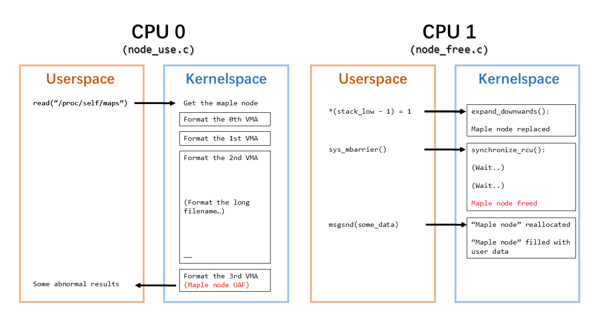
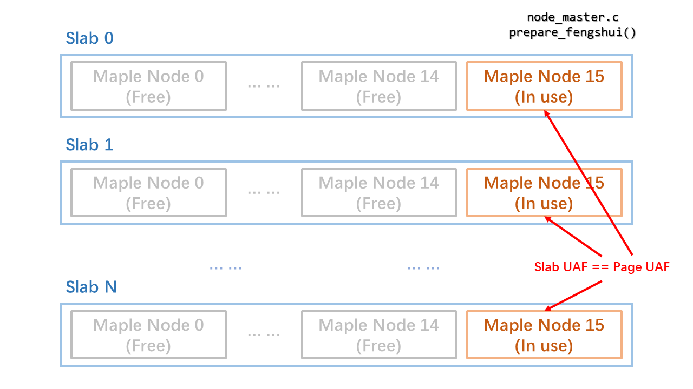
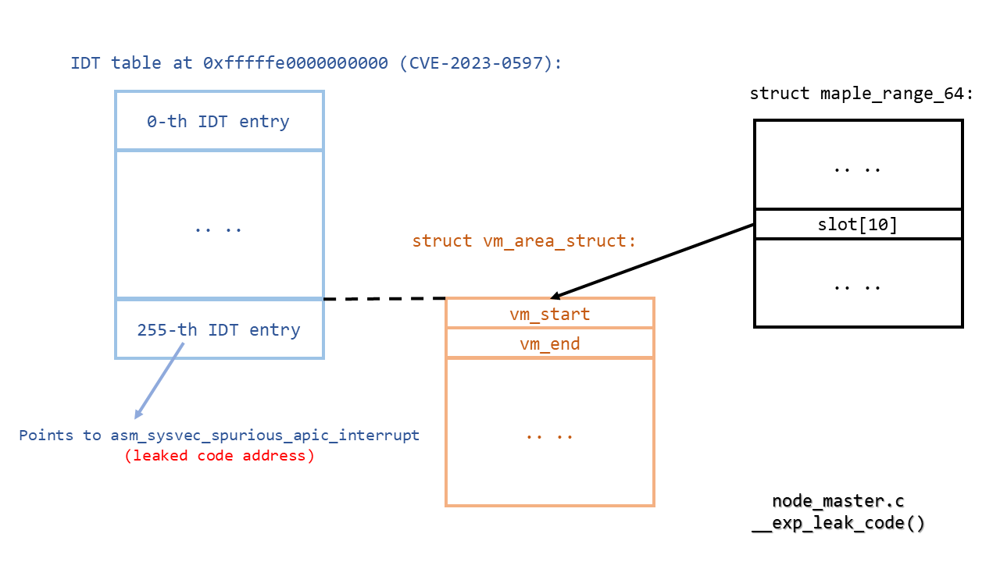
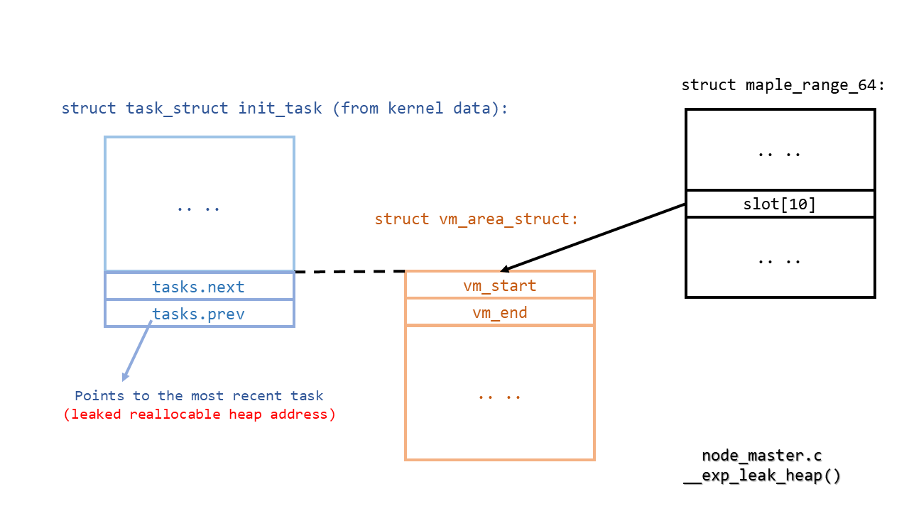
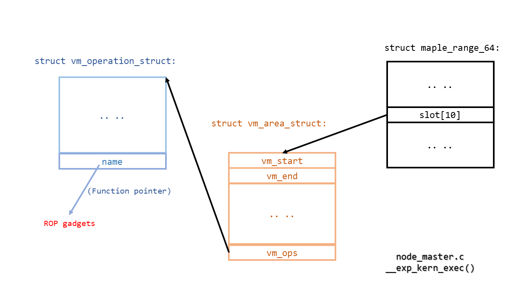

# StackRot (CVE-2023-3269): Linux kernel privilege escalation vulnerability

[][ci]
[*(GitHub-CI-verified exploit)*][ci]

 [ci]: https://github.com/lrh2000/StackRot/actions

A flaw was found in the handling of stack expansion in the Linux kernel 6.1
through 6.4, aka "Stack Rot". The maple tree, responsible for managing virtual
memory areas, can undergo node replacement without properly acquiring the MM
write lock, leading to use-after-free issues. An unprivileged local user could
use this flaw to compromise the kernel and escalate their privileges.

As StackRot is a Linux kernel vulnerability found in the memory management
subsystem, it affects almost all kernel configurations and requires minimal
capabilities to trigger. However, it should be noted that maple nodes are freed
using RCU callbacks, delaying the actual memory deallocation until after the
RCU grace period. Consequently, exploiting this vulnerability is considered
challenging.

To the best of my knowledge, there are currently no publicly available exploits
targeting use-after-free-by-RCU (UAFBR) bugs. This marks the first instance
where UAFBR bugs have been proven to be exploitable, even without the presence
of CONFIG_PREEMPT or CONFIG_SLAB_MERGE_DEFAULT settings. Notably, this exploit
has been successfully demonstrated in the environment provided by [Google kCTF
VRP][ctf] ([bzImage_upstream_6.1.25][img], [config][cfg]).

 [ctf]: https://google.github.io/kctf/vrp.html
 [img]: https://storage.googleapis.com/kctf-vrp-public-files/bzImage_upstream_6.1.25
 [cfg]: https://storage.googleapis.com/kctf-vrp-public-files/bzImage_upstream_6.1.25_config

The StackRot vulnerability has been present in the Linux kernel since version
6.1 when the VMA tree structure was [changed][ch] from red-black trees to maple
trees.

 [ch]: https://lore.kernel.org/lkml/20220906194824.2110408-1-Liam.Howlett@oracle.com/

## Background

Whenever the `mmap()` system call is utilized to establish a memory mapping,
the kernel generates a structure called `vm_area_struct` to represent the
corresponding virtual memory area (VMA). This structure stores various
information including flags, properties, and other pertinent details related to
the mapping.

```c
struct vm_area_struct {
        long unsigned int          vm_start;             /*     0     8 */
        long unsigned int          vm_end;               /*     8     8 */
        struct mm_struct *         vm_mm;                /*    16     8 */
        pgprot_t                   vm_page_prot;         /*    24     8 */
        long unsigned int          vm_flags;             /*    32     8 */
        union {
                struct {
                        struct rb_node rb __attribute__((__aligned__(8))); /*    40    24 */
                        /* --- cacheline 1 boundary (64 bytes) --- */
                        long unsigned int rb_subtree_last; /*    64     8 */
                } __attribute__((__aligned__(8))) shared __attribute__((__aligned__(8))); /*    40    32 */
                struct anon_vma_name * anon_name;        /*    40     8 */
        } __attribute__((__aligned__(8)));               /*    40    32 */
        /* --- cacheline 1 boundary (64 bytes) was 8 bytes ago --- */
        struct list_head           anon_vma_chain;       /*    72    16 */
        struct anon_vma *          anon_vma;             /*    88     8 */
        const struct vm_operations_struct  * vm_ops;     /*    96     8 */
        long unsigned int          vm_pgoff;             /*   104     8 */
        struct file *              vm_file;              /*   112     8 */
        void *                     vm_private_data;      /*   120     8 */
        /* --- cacheline 2 boundary (128 bytes) --- */
        atomic_long_t              swap_readahead_info;  /*   128     8 */
        struct vm_userfaultfd_ctx  vm_userfaultfd_ctx;   /*   136     0 */

        /* size: 136, cachelines: 3, members: 14 */
        /* forced alignments: 1 */
        /* last cacheline: 8 bytes */
} __attribute__((__aligned__(8)));
```

Subsequently, when the kernel encounters page faults or other memory-related
system calls, it requires fast lookup of the VMA solely based on the address.
Previously, the VMAs were managed using red-black trees. However, starting from
Linux kernel version 6.1, the migration to maple trees took place. [Maple
trees][mt] are RCU-safe B-tree data structures optimized for storing
non-overlapping ranges. Nonetheless, their intricate nature adds complexity to
the codebase and introduces the StackRot vulnerability.

 [mt]: https://docs.kernel.org/6.4/core-api/maple_tree.html

At its core, a maple tree is made up of maple nodes. While the tree's structure
may be complex, it's important to note that this complexity has nothing to do
with the StackRot bug. Therefore, throughout this article, it is assmued that
the maple tree consists of only one node, i.e., the root node.

This root node can contain up to 16 intervals. These intervals may either
represent a gap or point to a VMA. As gaps also count as intervals, all
intervals are connected sequentially, resulting in the need for only 15
endpoints, also known as pivots, within the node's structure. Note that the
leftmost endpoint and the rightmost endpoint are omitted, as they can be
retrieved from the parent node.

```c
struct maple_range_64 {
        struct maple_pnode *       parent;               /*     0     8 */
        long unsigned int          pivot[15];            /*     8   120 */
        /* --- cacheline 2 boundary (128 bytes) --- */
        union {
                void *             slot[16];             /*   128   128 */
                struct {
                        void *     pad[15];              /*   128   120 */
                        /* --- cacheline 3 boundary (192 bytes) was 56 bytes ago --- */
                        struct maple_metadata meta;      /*   248     2 */
                };                                       /*   128   128 */
        };                                               /*   128   128 */

        /* size: 256, cachelines: 4, members: 3 */
};
```

The `maple_range_64` structure, as shown above, represents a maple node. In
addition to the pivots, the slots are used to refer to the VMA structure when
the node functions as a leaf node, or to other maple nodes when the node
functions as an interior node. If an interval corresponds to a gap, the slot
will simply contain a NULL value. The arrangement of pivot points and slots can
be visualized as illustrated below:

```
 Slots -> | 0 | 1 | 2 | ... | 12 | 13 | 14 | 15 |
          ┬   ┬   ┬   ┬     ┬    ┬    ┬    ┬    ┬
          │   │   │   │     │    │    │    │    └─ Implied maximum
          │   │   │   │     │    │    │    └─ Pivot 14
          │   │   │   │     │    │    └─ Pivot 13
          │   │   │   │     │    └─ Pivot 12
          │   │   │   │     └─ Pivot 11
          │   │   │   └─ Pivot 2
          │   │   └─ Pivot 1
          │   └─ Pivot 0
          └─  Implied minimum
```

Regarding concurrent modification, the maple tree imposes a specific
restriction, that is, an exclusive lock must be held by writers (*Rule W*). In
the case of the VMA tree, the exclusive lock corresponds to the MM write lock.
As for readers, two options are available. The first option involves holding
the MM read lock (*Rule A1*), which results in the writer being blocked by the
MM read-write lock. Alternatively, the second option is to enter the RCU
critical section (*Rule A2*). By doing so, the writer is not blocked, and
readers can continue their operations since the maple tree is RCU-safe. While
most existing VMA accesses opt for the first option (i.e., Rule A1), Rule A2 is
employed in a few performance-critical scenarios, such as lockless page faults.

However, there is an additional aspect that requires particular attention,
which pertains to stack expansion. The stack represents a memory area that is
mapped with the MAP_GROWSDOWN flag, indicating automatic expansion when an
address below the region is accessed. In such cases, the start address of the
corresponding VMA is adjusted, as well as the associated interval within the
maple tree. Notably, these adjustments are made without holding the MM write
lock.

```c
static inline
void do_user_addr_fault(struct pt_regs *regs,
                        unsigned long error_code,
                        unsigned long address)
{
	// ...

	if (unlikely(!mmap_read_trylock(mm))) {
		// ...
	}
	// ...
	if (unlikely(expand_stack(vma, address))) {
		// ...
	}

	// ...
}
```

Typically, a gap exists between the stack VMA and its neighboring VMA, as the
kernel enforces a stack guard. In this scenario, when expanding the stack, only
the pivot value in the maple node needs updating, a process that can be
performed atomically. However, if the neighboring VMA also possesses the
MAP_GROWSDOWN flag, no stack guard is enforced.

```c
int expand_downwards(struct vm_area_struct *vma, unsigned long address)
{
	// ...

	if (prev) {
		if (!(prev->vm_flags & VM_GROWSDOWN) &&
		    vma_is_accessible(prev) &&
		    (address - prev->vm_end < stack_guard_gap))
			return -ENOMEM;
	}

	// ...
}
```

As a result, the stack expansion can eliminate the gap. In such situations, the
gap interval within the maple node must be removed. As the maple tree is
RCU-safe, overwriting the node in-place is not possible. Instead, a new node is
created, triggering node replacement, and the old node is subsequently
destroyed using an RCU callback.

```c
static inline void mas_wr_modify(struct ma_wr_state *wr_mas)
{
	// ...

	if ((wr_mas->offset_end - mas->offset <= 1) &&
	    mas_wr_slot_store(wr_mas))           // <-- in-place update
		return;
	else if (mas_wr_node_store(wr_mas))      // <-- node replacement
		return;

	// ...
}
```

The RCU callback is invoked only after all pre-existing RCU critical sections
have concluded. However, the issue arises when accessing VMAs, as only the MM
read lock is held, and it does not enter the RCU critical section (according to
Rule A1). Consequently, in theory, the callback could be invoked at any time,
resulting in the freeing of the old maple node. However, pointers to the old
node may have already been fetched, leading to a use-after-free bug when
attempting subsequent access to it.

The backtrace where use-after-free (UAF) occurs is shown below:

```
  - CPU 0 -                                        - CPU 1 -

  mm_read_lock()                                    mm_read_lock()
  expand_stack()                                    find_vma_prev()
    expand_downwards()                                mas_walk()
      mas_store_prealloc()                              mas_state_walk()
        mas_wr_story_entry()                              mas_start()
          mas_wr_modify()                                   mas_root()
            mas_wr_node_store()                               node = rcu_dereference_check()
              mas_replace()                                   [ The node pointer is recorded ]
                mas_free()
                  ma_free_rcu()
                    call_rcu(&mt_free_rcu)
                    [ The node is dead ]
  mm_read_unlock()

  [ Wait for the next RCU grace period.. ]
  rcu_do_batch()                                      mas_prev()
    mt_free_rcu()                                       mas_prev_entry()
      kmem_cache_free()                                   mas_prev_nentry()
      [ The node is freed ]                                 mas_slot()
                                                              mt_slot()
                                                                rcu_dereference_check(node->..)
                                                                [ UAF occurs here ]
                                                    mm_read_unlock()
```

## Fix

I reported this vulnerability to the Linux kernel security team on June 15th.
Following that, the process of addressing this bug was led by Linus Torvalds.
Given its complexity, it took nearly two weeks to develop a set of patches that
received consensus.

On June 28th, during the merge window for Linux kernel 6.5, the fix was merged
into Linus' tree. Linus provided a [comprehensive merge message][fix] to
elucidate the patch series from a technical perspective.

 [fix]: https://git.kernel.org/pub/scm/linux/kernel/git/torvalds/linux.git/commit/?id=9471f1f2f50282b9e8f59198ec6bb738b4ccc009

These patches were subsequently backported to stable kernels ([6.1.37][6.1],
[6.3.11][6.3], and [6.4.1][6.4]), effectively resolving the "Stack Rot" bug on
July 1st.

 [6.1]: https://lore.kernel.org/stable/2023070133-create-stainless-9a8c@gregkh/T/
 [6.3]: https://lore.kernel.org/stable/2023070146-endearing-bounding-d21a@gregkh/T/
 [6.4]: https://lore.kernel.org/stable/2023070140-eldercare-landlord-133c@gregkh/T/

## Exploit

The exploit primarily focuses on the Google kCTF challenge, specifically when
neither CONFIG_PREEMPT nor CONFIG_SLAB_MERGE_DEFAULT is set. To exploit
StackRot, the most important task is to locate a VMA iteration that fulfills
the following criteria:
 1. The iteration's timing can be controlled. This control allows us to ensure
    that the RCU grace period concludes during the VMA iteration.
 2. The iteration retrieves specific information from the VMA structure, and
    returns the information to the userspace. This feature enables us to
    exploit the UAF vulnerability of the maple node to leak some kernel
    addresses.
 3. The iteration invokes certain function pointers in the VMA structure. This
    particular capability allows us to exploit the UAF of the maple node to
    control the kernel-mode program counter (PC).

The chosen VMA iteration is the iteration responsible for generating the
contents of `/proc/[pid]/maps`. The following sections will show how this
iteration satisfies the above criteria.

### Step 0: From UAFBR to UAF

During any VMA iteration, the reference to the root node of the VMA tree is
obtained, and the iteration proceeds through its slots. Thus, by triggering
stack expansion in another thread on a separate CPU during the VMA iteration,
the node replacement can be concurrently initiated. At this point, accessing
the old node is considered a use-after-free-by-RCU (UAFBR) situation. However,
actual issues arise only when the old node is truly freed, which occurs in the
RCU callback.

This presents two challenges: (i) determining when the old node is freed and
(ii) ensuring that the VMA iteration does not complete before the old node is
freed.

The first question is relatively straightforward. In the kernel, the
`synchronize_rcu()` function can be employed to wait until the RCU grace period
concludes, ensuring that all pre-existing RCU callbacks have been invoked. In
userspace, system calls that ultimately call `synchronize_rcu()` can be
utilized for the same purpose. Thus, when such system calls terminate, it is
known that the old node has been freed. Notably, there is a system call,
`membarrier(MEMBARRIER_CMD_GLOBAL, 0, -1)`, that solely invokes
`synchronize_rcu()`.

```c
SYSCALL_DEFINE3(membarrier, int, cmd, unsigned int, flags, int, cpu_id)
{
	// ...

	switch (cmd) {
	// ...
	case MEMBARRIER_CMD_GLOBAL:
		/* MEMBARRIER_CMD_GLOBAL is not compatible with nohz_full. */
		if (tick_nohz_full_enabled())
			return -EINVAL;
		if (num_online_cpus() > 1)
			synchronize_rcu();
		return 0;
	// ...
	}
}
```

The second question necessitates further consideration. Several potential
solutions are as follows:
 1. The iteration task gets preempted, the RCU grace period ends, and the
    iteration resumes execution. However, this approach is ineffective if
    CONFIG_PREEMPT is not set.
 2. The iteration task enters a sleep state (e.g., waiting for I/O), the RCU
    grace period ends, and the iteration continues. Currently, I am unaware of
    any VMA iteration that satisfies this requirement and can be exploited to
    leak kernel addresses and control the program counter (PC). It may exist,
    but a thorough investigation is required.
 3. The iteration task experiences an interruption (e.g., timer interrupt),
    during which the RCU grace period concludes. It is possible to employ
    timerfd to create multiple hardware timers that, upon timeout during the
    VMA iteration, can trigger a lengthy interrupt. However, this approach is
    not viable because the interrupt handler operates with interrupts disabled,
    and if a CPU cannot handle inter-processor interrupts (IPIs), the RCU grace
    period will not end.
 4. The iteration task is deliberately prolonged, allowing the RCU grace period
    to expire. This is the chosen solution. If the current RCU grace period
    surpasses RCU_TASK_IPI_DELAY (defaulting to 0.5 seconds), inter-processor
    interrupts (IPIs) are dispatched to all CPUs to verify that they are not in
    RCU critical sections. In the case of VMA iteration, the answer is
    negative, signifying that the RCU grace period concludes and the maple node
    is freed, effectively converting UAFBR into a genuine use-after-free (UAF)
    scenario.

One significant observation is that during VMA iteration for
`/proc/[pid]/maps`, it generates the entire file path for file-mapped memory
regions. Although the directory name is typically restricted to a maximum of
255 characters, there is no limitation on the directory depth. This means that
by creating a file with an exceedingly large directory depth and establishing a
memory mapping for this file, accessing `/proc/[pid]/maps` can take a
considerable amount of time during the VMA iteration. Consequently, this
extended duration enables the possibility of concluding the RCU grace period
and acquiring the UAF primitive.

```c
static void
show_map_vma(struct seq_file *m, struct vm_area_struct *vma)
{
	// ...

	/*
	 * Print the dentry name for named mappings, and a
	 * special [heap] marker for the heap:
	 */
	if (file) {
		seq_pad(m, ' ');
		/*
		 * If user named this anon shared memory via
		 * prctl(PR_SET_VMA ..., use the provided name.
		 */
		if (anon_name)
			seq_printf(m, "[anon_shmem:%s]", anon_name->name);
		else
			seq_file_path(m, file, "\n");
		goto done;
	}

	// ...
}
```

This step is illustrated in the following figure:



### Step 1: From slab UAF to page UAF

Now that UAF is functioning within a slab. If CONFIG_SLAB_MERGE_DEFAULT is
enabled and the slab of maple nodes merges with kmalloc-256, the contents
within the old node can be controlled by allocating a new structure from
kmalloc-256 and populating it with userspace data. However, if
CONFIG_SLAB_MERGE_DEFAULT is not set, an alternative approach is required. In
this case, one needs to return the page of the freed node to the page
allocator, allowing the old node to be controlled by allocating a new page and
filling it accordingly.

Recall that the VMA tree will only contain one node. Hence, by utilizing
`fork()`/`clone()`, multiple VMA trees and an equal number of maple nodes are
generated. Assuming one slab encompasses M maple nodes, and one node per M
nodes is retained while all other nodes are freed via `exit()`, the remaining
nodes become the sole nodes within their respective slabs. Initially, these
slabs reside in the CPU's partial list. When the partial list reaches its
capacity, the slabs are flushed back to the partial list of the corresponding
NUMA node.

If the last maple node within a slab is freed, the slab becomes empty. If this
slab resides in the partial list of a NUMA node, and the partial list of that
particular NUMA node is already at maximum capacity, the page is immediately
returned to the page allocator. Consequently, the slab UAF transforms into a
page UAF scenario. The contents within the freed page can be manipulated by
sending some data via `msgsnd()`, which allocates elastic objects and directly
populates them with the provided user data.

```c
static void __slab_free(struct kmem_cache *s, struct slab *slab,
			void *head, void *tail, int cnt,
			unsigned long addr)

{
	// ...

	if (unlikely(!new.inuse && n->nr_partial >= s->min_partial))
		goto slab_empty;

	// ...
	return;

slab_empty:
	// ...
	discard_slab(s, slab);
}
```

The number of maple nodes per slab, M, depends on the number of CPUs. The
exploit implementation considers a situation with two CPUs and therefore
assumes 16 as the value of M, as illustrated in the following figure:



### Step 2: From UAF to address leaking

Upon gaining control of the maple node, it becomes possible to manipulate the
addresses of subsequent VMAs that will be later iterated. As the targeted
iteration is aimed at generating `/proc/self/maps`, certain VMA information,
such as the start and end addresses, which reside within the VMA structure, are
returned to the user space.

However, a challenge arises: the address of a VMA structure in the maple node
can only be appropriately set if some addresses are already known. Fortunately,
CVE-2023-0597 directly serves this purpose. According to CVE-2023-0597, the
address of `cpu_entry_area` is not randomized. Although this vulnerability has
been patched in Linux 6.2, it has not been backported to earlier stable kernels
as of the time of writing. Consequently, by overwriting the address of the VMA
structure with that of the last IDT entry, the entry that contains the address
of `asm_sysvec_spurious_apic_interrupt` is directly leaked, thereby revealing
the base addresses of the kernel code and kernel data.



The previously discussed method can be used recurrently to incrementally expose
more addresses from the kernel data section. For instance, the
`init_task.tasks.prev` pointer within the data section directs to the
`task_struct` structure of the latest created task, which is without question
allocated on the heap.



When all newly established tasks are terminated, their `task_struct` structures
will subsequently be deallocated. If the quantity of these tasks is large
enough, the corresponding pages can be surrendered back to the page allocator.
This allows for the possibility to reallocate these pages and fill them with
user data. However, keep in mind that the released pages generally belong to
the per-cpu page (PCP) list. For pages present in the PCP list, they can be
reallocated exclusively in the same page order. Consequently, solely mapping
new pages into the user space, which requires only order-0 pages from the page
allocator, won't fulfill the objectives.

Nonetheless, the msgsnd system call will solicit memory chunks via kmalloc and
populate these chunks with user-defined data. When the kmalloc cache is
exhausted, it will requisition pages from the page allocator at a specific
order. If the message size is accurately adjusted, the exact order will be
desired. Thus, the page whose address has been previously leaked will be
reallocated. As a result, it becomes possible to obtain a page with a known
address and user-manipulated data.

### Step 3: From UAF to root privileges

It is now possible to forge the VMA structure in the address-known page and
control the `vma->vm_ops->name` function pointer. The next step involves
finding suitable gadgets to escape containers and acquire root privileges.

```c
static void
show_map_vma(struct seq_file *m, struct vm_area_struct *vma)
{
	// ...

	if (vma->vm_ops && vma->vm_ops->name) {
		name = vma->vm_ops->name(vma);
		if (name)
			goto done;
	}

	// ...
}
```



The gadget constructions are as follows:
 1. Stack pivot: `movq %rbx, %rsi; movq %rbp, %rdi; call
    __x86_indirect_thunk_r13` -> `pushq %rsi; jmp 46(%rsi)` -> `popq %rsp; ret`
    -> `popq %rsp; ret`, where %rdi, %rbx, and %r13 _initially_ points to
    user-controllable data.
 2. Gain root privileges: `popq %rdi; ret` -> `prepare_kernel_cred` -> `popq
    %rdi; ret` -> `movq %rax, (%rdi); ret`, where %rdi _now_ points to the
    stack top; `popq %rdi; ret` -> `commit_creds`, effectively executing
    `commit_creds(prepare_kernel_cred(&init_task))`.
 3. Escape containers: `popq %rdi; ret` -> `find_task_by_vpid` -> `popq %rdi;
    ret` -> `movq %rax, (%rdi); ret`, where %rdi _now_ points to the stack top;
    `popq %rdi; ret` -> `popq %rsi; ret` -> `switch_task_namespaces`,
    effectively performing `switch_task_namespaces(find_task_by_vpid(1),
    &init_nsproxy)`.
 4. Unlock mm: `popq %rax; ret` -> `movq %rbp, %rdi; call
    __x86_indirect_thunk_rax`, where %rbp points to the original seq_file;
    `popq %rax; ret` -> `m_stop`, effectively executing `m_stop(seq_file, ..)`.
 5. Return to userspace: use `swapgs_restore_regs_and_return_to_usermode`, and
    call `execve()` to get the shell.

Finally, using `nsenter --mount=/proc/1/ns/mnt` to restore the mount namespace
and get the flag via `cat /flag/flag`.

### Source code

The full exploit source is available [here](/exp). For more details, refer to
its README file.
